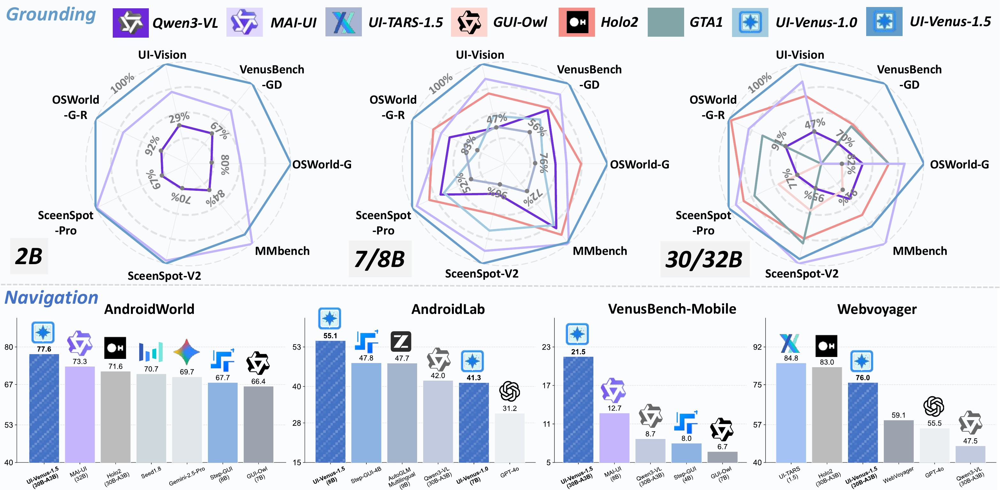

<h1 align="center">
   UI-Venus 1.5
</h1>


<p align="center">
  <a href="https://opensource.org/licenses/Apache-2.0"></a>
  <a href="https://arxiv.org/abs/2602.09082"></a>
  <a href="https://github.com/inclusionAI/UI-Venus"></a>
  <a href="https://huggingface.co/collections/inclusionAI/ui-venus-689f2fb01a4234cbce91c56a"></a>
</p>

<p align="center">
  <em>UI-Venus 1.5 is a unified, end-to-end GUI Agent designed for robust real-world applications. The model family includes two dense (2B/8B) and one MoE (30B-A3B) variants to meet various downstream scenarios.</em>
</p>

**Upgrades from UI-Venus 1.0:**
- 🔹 **Mid-Training Stage**: 10B tokens across 30+ datasets for foundational GUI semantics
- 🔹 **Online RL**: Full-trajectory rollouts for long-horizon dynamic navigation
- 🔹 **Model Merging**: Unified agent combining grounding, web, and mobile specialists

**Results:** SOTA on ScreenSpot-Pro (69.6%), VenusBench-GD (75.0%), AndroidWorld (77.6%), with robust navigation across 40+ Chinese mobile apps.

---

<p align="center">
  📈 <strong>UI-Venus Benchmark Performance</strong>
</p>

<p align="center">
  
</p>

> **Figure:** Performance of UI-Venus 1.5 across multiple benchmarks. UI-Venus 1.5 achieves **State-of-the-Art (SOTA)** results on key grounding benchmarks (**ScreenSpot-Pro**, **VenusBench-GD**, **OSWorld-G**, **UI-Vision**) and agent benchmarks (**AndroidWorld**, **AndroidLab**, **VenusBench-Mobile**).

---

# 🚀 News

* [2026/02] We release **UI-Venus 1.5**, an end-to-end GUI Agent designed for robust real-world applications.
* [2026/02] We release **VenusBench-Mobile**, a challenging online benchmark for mobile GUI agents. See branch [VenusBench-Mobile](https://github.com/inclusionAI/UI-Venus/tree/VenusBench-Mobile).
* [2025/12] We release [VenusBench-GD](https://ui-venus.github.io/VenusBench-GD/), a comprehensive multi-platform GUI grounding benchmark. See branch [VenusBench-GD](https://github.com/inclusionAI/UI-Venus/tree/VenusBench-GD).
* [2025/8] We release **[UI-Venus 1.0](https://github.com/inclusionAI/UI-Venus/tree/UI-Venus-1.0)**, the first version of our UI agent model.

---

# Overview

* [Demo](#-demo)
* [Venus Framework](#venus-framework)
* [Quick Start](#-quick-start)
* [Benchmark Results](#detailed-benchmark-results)
* [Citation](#citation)

---

# ✨ Demo

### Chinese App Demo Videos / 中文应用演示视频

#### Ximalaya - 喜马拉雅
**Open Ximalaya FM, play "Zootopia 2," and set the playback mode to list loop.**  
**打开喜马拉雅，帮我播放疯狂动物城2，设置列表循环播放**


---

#### Qimao Novel - 七猫免费小说
**Open Qimao Free Webnovel and add the top 3 books from the "Creative/Mind-bending" chart to the bookshelf.**  
**打开七猫免费小说，将小说脑洞榜前三名都加入书架**


---

#### Weibo - 微博
**Open Weibo, search for "Hangzhou Weather," and post a comment based on the current weather.**  
**打开微博，搜索杭州天气，并根据天气进行评论**


---

#### Xiaohongshu - 小红书
**Open Xiaohongshu, search for baking tutorials, and play a video with over 10,000 views.**  
**打开小红书，搜索烘焙教程，找到播放量大于1w的视频进行播放**


---

#### Toutiao - 今日头条
**Open Toutiao, click on the top trending story, and view the "Event Summary.**  
**打开今日头条，点击进入热榜第1名，查看事件速览**


---

# Venus Framework

We provide a complete Android automation framework for deploying UI-Venus 1.5 as an autonomous mobile agent.

**Features:**
- 🎯 Single task execution with natural language
- 🔄 Multi-device parallel batch processing
- 📊 Trajectory recording and replay
- 🔁 Intelligent loop detection

👉 **[Documentation →](./Venus_framework/README.md)** | **[中文文档 →](./Venus_framework/README_CN.md)**


**Supported:** 40+ mainstream Chinese apps including Weibo, Xiaohongshu, Taobao, Meituan, Bilibili, Alipay, and more.

---

# 🚀 Quick Start

### Installation

```bash
pip install -r requirements.txt
```

### Grounding Evaluation

Edit `scripts/run_gd_auto.sh` or `scripts/run_gd_ddp.sh` to configure:

```bash
# GPU Configuration
export CUDA_VISIBLE_DEVICES=0,1,2,3,4,5,6,7

# Model Configuration
MODEL_PATH="/path/to/UI-Venus-1.5"  # Your model checkpoint path

# Dataset Configuration (uncomment one)
# ScreenSpot-Pro
IMGS_PATH="/path/to/Screenspot-pro/images"
TEST_PATH="/path/to/Screenspot-pro/annotations"
```

Run evaluation:

```bash
# Single/Multi-GPU with device_map="auto"
bash scripts/run_gd_auto.sh

# Multi-GPU with DDP (faster for large datasets)
bash scripts/run_gd_ddp.sh
```

### Navigation Evaluation

Edit `scripts/run_navi.sh` to configure:

```bash
# GPU Configuration
CUDA_DEVICES="0,1,2,3"

# Model Configuration
MODEL_PATH="/path/to/UI-Venus-1.5"

# Input/Output
INPUT_FILE="examples/trace/trace.json"   # Navigation task file
OUTPUT_FILE="./results/navi/output.json"

# Prompt Type Configuration (important!)
PROMPT_TYPE="mobile"      # Options: "web" for web tasks, "mobile" for mobile tasks (default: mobile)

# vLLM Configuration
TENSOR_PARALLEL_SIZE=4    # Should match GPU count
GPU_MEMORY_UTIL=0.8       # Reduce if OOM
MAX_MODEL_LEN=16192
```

**Prompt Type Selection:**
- `PROMPT_TYPE="mobile"` - Use mobile-specific prompts for Android/iOS app navigation tasks
- `PROMPT_TYPE="web"` - Use web-specific prompts for browser/web page navigation tasks

Run evaluation:

```bash
# Default: Mobile prompt
bash scripts/run_navi.sh

```

---

# Detailed Benchmark Results

### Grounding Benchmarks

| Models | VenusBench-GD | ScreenSpot-Pro | OSworld-G | UI-Vision |
|--------|:-------------:|:--------------:|:---------:|:---------:|
| Qwen3-VL-30B-A3B | 52.4 | 53.7 | 69.3 | 61.2 |
| Step-GUI-8B | - | 62.6 | - | - |
| MAI-UI-8B | 65.2 | 65.8 | 60.1 | 40.7 |
| MAI-UI-32B | - | 67.9 | 67.6 | 47.1 |
| UI-Venus-1.0-7B | 49.0 | 50.8 | 54.6 | 26.5 |
| UI-Venus-1.0-72B | 70.2 | 61.9 | 62.2 | 36.8 |
| **UI-Venus-1.5-2B** | **67.3** | **57.7** | **59.4** | **44.8** |
| **UI-Venus-1.5-8B** | **72.3** | **68.4** | **69.7** | **46.5** |
| **UI-Venus-1.5-30B-A3B** | **75.0** | **69.6** | **70.6** | **54.7** |


### Navigation Benchmarks

| Models | Params | AndroidWorld | AndroidLab | VenusBench-Mobile | WebVoyager |
|--------|:------:|:------------:|:----------:|:-----------------:|:----------:|
| *General VLMs* | | | | | |
| GPT-4o | - | - | 31.2 | - | 55.5 |
| Claude-3.7 | - | - | - | - | 84.1 |
| Qwen3-VL-30B-A3B | 30B | 54.3 | 42.0* | 8.7 | 47.5* |
| GLM-4.6V | 106B | 57.0 | - | - | - |
| Gemini-2.5-Pro | - | 69.7 | - | - | - |
| Seed1.8 | - | 70.7 | - | - | - |
| *GUI-specific Models* | | | | | |
| UI-TARS-72B | 72B | 46.6 | - | - | - |
| UI-TARS-1.5 | - | - | - | - | 84.8 |
| Step-GUI-8B | 8B | 67.7 | 47.8* | 8.0 | - |
| Holo2-30B-A3B | 30B | 71.6 | - | - | 83.0 |
| MAI-UI-8B | 8B | 70.7 | - | 12.7 | - |
| MAI-UI-32B | 32B | 73.3 | - | - | - |
| OpenAI-CUA | - | - | - | - | **87.0** |
| AutoGLM-Mobile | 9B | - | 46.8 | - | - |
| *Ours* | | | | | |
| UI-Venus-1.0-7B | 7B | 49.1 | 41.3 | 8.1 | - |
| UI-Venus-1.0-72B | 72B | 65.9 | 49.3 | 15.4 | - |
| **UI-Venus-1.5-2B** | 2B | 55.6 | 36.2 / 44.2† | 8.7 | 56.4 |
| **UI-Venus-1.5-8B** | 8B | 73.7 | **55.1** / 68.1† | 16.1 | 70.8 |
| **UI-Venus-1.5-30B-A3B** | 30B | **77.6** | 52.9 / 68.1† | **21.5** | 76.0 |

> \* Results evaluated by us. † Results manually verified by human evaluators.

---

# Citation

If you find our work helpful, please cite:

```bibtex
# UI-Venus 1.5
@misc{venusteam2026uivenus15technicalreport,
      title={UI-Venus-1.5 Technical Report}, 
      author={Venus-Team and Changlong Gao and Zhangxuan Gu and Yulin Liu and Xinyu Qiu and Shuheng Shen and Yue Wen and Tianyu Xia and Zhenyu Xu and Zhengwen Zeng and Beitong Zhou and Xingran Zhou and Weizhi Chen and Sunhao Dai and Jingya Dou and Yichen Gong and Yuan Guo and Zhenlin Guo and Feng Li and Qian Li and Jinzhen Lin and Yuqi Zhou and Linchao Zhu and Liang Chen and Zhenyu Guo and Changhua Meng and Weiqiang Wang},
      year={2026},
      eprint={2602.09082},
      archivePrefix={arXiv},
      primaryClass={cs.CV},
      url={https://arxiv.org/abs/2602.09082}, 
}

# UI-Venus 1.0
@misc{gu2025uivenustechnicalreportbuilding,
      title={UI-Venus Technical Report: Building High-performance UI Agents with RFT}, 
      author={Zhangxuan Gu and Zhengwen Zeng and Zhenyu Xu and others},
      year={2025},
      eprint={2508.10833},
      archivePrefix={arXiv},
      primaryClass={cs.CV},
      url={https://arxiv.org/abs/2508.10833}, 
}
```

---

# License

This project is for research and educational purposes only.
