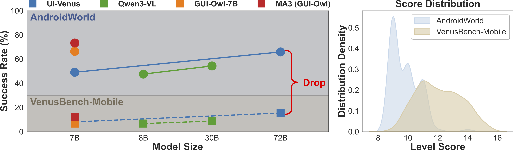

# VenusBench-Mobile: A Challenging and User-Centric Benchmark for Mobile GUI Agents with Capability Diagnostics


VenusBench-Mobile is a comprehensive evaluation platform designed for general-purpose mobile GUI agents. The benchmark incorporates 27 open-source Android applications, expanding significantly upon previous suites to enhance GUI diversity. It features a primary pool of 149 manually curated tasks, plus an additional 80 systematic variants specifically designed for stability and robustness testing. For verification, tasks are evaluated through either programmatic OS state inspection or MLLM-based judgment, depending on task characteristics. This infrastructure provides a reproducible environment for assessing agents in realistic, dynamic mobile settings.

For more details, please refer to the paper included in the venusbench_mobile_paper.

## Performance Gap & Difficulty Distribution

<!--  -->


VenusBench-Mobile reveals a significant performance gap compared to existing benchmarks:

- **Significant Success Rate Drop**: SOTA agents experience a sharp decline in success rates (averaging a ~50% drop) when moving from AndroidWorld to VenusBench-Mobile.
- **Discriminative Difficulty**: As shown in the level score distribution, our benchmark provides a wider spread of task difficulties, effectively distinguishing high-proficiency agents from basic ones.

------

## Comparison with Existing Benchmarks

Compared to previous work, VenusBench-Mobile offers superior coverage and diagnostic depth (“Verif.” indicates whether the benchmark supports automated verification of task completion, enabling reproducible evaluation. “Cost” denotes whether the benchmark reports inference costs during task execution, such as time or token consumption):

| **Benchmark**                | **#Apps** | **# Tasks**  | **Verif.** | **Cost** | **FA** | **CF** | **VA** | **MR** | **GSA** | **GUIM** | **HGB** | **NR** | **BC** | **ST** |
| ---------------------------- | --------- | ------------ | ---------- | -------- | ------ | ------ | ------ | ------ | ------- | -------- | ------- | ------ | ------ | ------ |
| LearnGUI                     | 20        | 101          | ✓          |          |        |        |        |        |         |          | ✓       |        |        |        |
| MMBench-GUI                  | -         | 146          | ✓          |          |        |        |        |        |         |          |         |        |        |        |
| UI-NEXUS                     | 20        | 100          | ✓          | ✓        | ✓      |        |        |        |         |          |         |        |        |        |
| MVISU                        | 137       | 404          |            | ✓        |        | ✓      | ✓      |        |         |          | ✓       |        |        |        |
| AndroidWorld                 | 20        | 116          | ✓          | ✓        |        |        |        |        |         |          | ✓       |        |        | ✓      |
| AndroidLab                   | 9         | 138          | ✓          | ✓        |        |        |        |        |         |          |         |        |        |        |
| MobileAgentBench             | 10        | 100          | ✓          | ✓        |        |        |        |        |         |          |         |        |        |        |
| AndroidDaily                 | 48        | 235          |            |          |        |        |        |        |         |          | ✓       |        |        |        |
| SPABench                     | 66        | 340          |            | ✓        |        |        |        |        |         |          |         |        |        |        |
| MobileWorld (GUI)            | 20        | 161          | ✓          |          |        | ✓      | ✓      | ✓      |         |          |         |        |        |        |
| **VenusBench-Mobile (Ours)** | **27**    | **149(+80)** | **✓**      | **✓**    | **✓**  | **✓**  | **✓**  | **✓**  | **✓**   | **✓**    | **✓**   | **✓**  | **✓**  | **✓**  |

VenusBench-Mobile provides superior coverage of diverse task categories and diagnostic depth compared to existing benchmarks, while maintaining a high standard for automated verification.

----

## Task Taxonomy

<!--  -->


VenusBench-Mobile employs a top-down, user-intent-driven design. It categorizes 10 essential dimensions to reflect the complexity and uncertainty of real-world environments:

- **Function Assistance (FA):** Agents explore app interfaces and features to summarize procedural knowledge and provide detailed steps for specific goals.
- **Conflict Handling (CF):** Tests the ability to identify and resolve contradictions or ambiguities between user instructions and the actual GUI environment.
- **Vague Instructions (VA):** Requires agents to interpret underspecified instructions that omit key contextual information by reasoning with the GUI environment.

- **Multi-round Interaction (MR):** Evaluates if agents can support multi-round dialogues, memorizing and integrating information from previous rounds to complete iterative tasks.
- **GUI State Awareness (GSA):** A unique category requiring agents to continuously monitor evolving interface states (e.g., timers or real-time displays) and make decisions accordingly.
- **Visual Manipulation (GUIM):** Requires fine-grained coordinate control and precise visual localization to perform operations on specific visual elements, such as drawing or marking objects.
- **Hard GUI Browsing (HGB):** Demands extensive page browsing and information synthesis across multiple screens and apps to process high volumes of content.
- **Noise Resistance (NR):** Evaluates in-task robustness by simulating environmental disruptions such as incoming calls, app crashes, or pop-ups during execution.
- **Browsecomp-like (BC):** Adapted from web browsing benchmarks, these tasks involve satisfyng multiple complex constraint conditions within mobile environments.
- **Stability Evaluation (SE):** Measures consistency by running the same task across five different modes: Original, Question Variation, Chinese, Mobile Dark mode, and Pad mode.


## Deployment Guide

This document will also guide you through deploying the complete VenusBench-Mobile evaluation framework from scratch.

---

## Project Structure

The entire framework is organized under the parent directory **`venusbench_mobile`**. Below is the core file and directory layout:

| Directory/File                             | Description                   | Key Functionality                                            |
| :----------------------------------------- | :---------------------------- | :----------------------------------------------------------- |
| **`run_venusbenchnavi.py`**                | **Main Entry Point**          | The primary script for running evaluation tasks and interacting with Agents. |
| **`run_venusbenchnavi_install_app.py`**    | **App Installer**             | Automatically connects to the emulator and installs all required APK files for the benchmark. |
| **`task_instance_goal.json`**              | **Task Query Library**        | The central repository containing the task names and their corresponding evaluation queries. |
| **`start_run_gemini3.sh`**                 | **Evaluation Script Example** | A sample shell script used to execute the Agent for performance evaluation. |
| **`scripts/extract_vis.sh`**               | **Visualization Launcher**    | A script used to extract and visualize the execution trajectories and results of the Agent. |
| **`config/venus_benchmark_settings.yaml`** | **Core Configuration**        | Central configuration file used to set APK storage paths, local and remote resource directories, ADB tool locations, and Agent API credentials. |
| **`android_world/agents`**                 | **Agent Repository**          | The directory where the various AI Agent implementation files used for evaluation are stored. |
| **`android_world/registry.py`**            | **Task Registry**             | The core file containing the summary and registration information for all evaluation tasks. |
| **`android_world/policy`**                 | **Evaluation Verifier**       | Contains the logic for verifying and grading MLLM-Judge tasks to ensure accurate performance assessment. |

---

## Table of Contents

1. [Prerequisites](#prerequisites)
2. [Step 1: Deploy AndroidWorld Environment](#step-1-deploy-androidworld-environment)
3. [Step 2: Download Required Files](#step-2-download-required-files)
4. [Step 3: Install Applications](#step-3-install-applications)
5. [Step 4: Configure venus_benchmark_settings.yaml](#step-4-configure-venus_benchmark_settingsyaml)
6. [Step 5: Verify Deployment](#step-5-verify-deployment)
7. [Running Evaluations](#running-evaluations)
8. [Troubleshooting](#troubleshooting)

---

## Prerequisites

### System Requirements

- **OS**: Linux (recommended Ubuntu 20.04+) or macOS
- **Python**: 3.9+
- **Disk Space**: At least 50GB (including Android SDK, emulator, and data files)
- **Network**: Stable internet connection (needed for downloading Android SDK and related files)

### Hardware Requirements

- **CPU**: Intel/AMD processor with virtualization support (VT-x/AMD-V)
- **RAM**: At least 16GB (recommended 32GB+)
- **GPU**: Optional, but recommended NVIDIA GPU for inference acceleration

### Required Tools

- `git`
- `curl` or `wget`
- Java JDK 11+
- Android SDK (will be obtained during installation)

---

## Step 1: Deploy AndroidWorld Environment

### 1.1 Clone Repository

```bash
# Clone the official Android World repository
git clone https://github.com/google-research/android_world.git
cd android_world

# Or clone your fork (if available)
# git clone <your-fork-url>
# cd android_world
```

### 1.2 Install Dependencies

```bash
# Install Android World and dependencies
pip install -e .

# Install additional dependencies (if needed)
pip install -r requirements.txt
```

### 1.3 Configure Android SDK

```bash
# Download and configure Android SDK
# If you don't have Android SDK yet, use one of these methods

# Method 1: Using official sdkmanager (if SDK is already installed)
export ANDROID_HOME=$HOME/android/android_sdk
export PATH=$ANDROID_HOME/tools/bin:$ANDROID_HOME/platform-tools:$PATH

# Method 2: Install via package manager (recommended for Ubuntu)
sudo apt-get update
sudo apt-get install -y android-sdk-linux

# Method 3: Manual download
# Visit https://developer.android.com/studio to download Command line tools
# Extract and configure ANDROID_HOME environment variable
```

### 1.4 Download Android Emulator System Image

```bash
# Set ANDROID_HOME (if not already set)
export ANDROID_HOME=$HOME/android/android_sdk
export PATH=$ANDROID_HOME/emulator:$ANDROID_HOME/platform-tools:$PATH

# Install required API level (recommended API 31+)
sdkmanager "platforms;android-31" "system-images;android-31;google_apis;x86_64"

# Create virtual device
avdmanager create avd -n android_world -k "system-images;android-31;google_apis;x86_64" -f
```

### 1.5 Start Emulator

```bash
# Start Android emulator
emulator -avd android_world -grpc 8554 &

# Or run in background
nohup emulator -avd android_world -grpc 8554 > emulator.log 2>&1 &

# Wait for emulator to fully start (approximately 30-60 seconds)
adb wait-for-device

# Verify connection
adb devices
```

### 1.6 Verify AndroidWorld Installation

```bash
# Enter project directory
cd android_world

# Run simple test
python -c "from android_world import registry; print('AndroidWorld installation successful!')"
```

---

## Step 2: Download Required Files

All required files (APK applications and external data files) are stored in venusbench_mobile_files directory.

### 2.1 Structure of venusbench_mobile_files

The required files include:

- **APK files** (6 applications required for the benchmark)
- **External data files** (videos, documents, images, web snapshots, etc.)
- **Ground truth files** (for locating tasks)

### 2.2 Check Files

```bash
# Verify APK directory
echo "Checking APK files..."
ls -lh apk/

# Expected APK files:
# - ADBKeyboard.apk
# - Calculator_9.0.apk
# - com.zell_mbc.medilog_5499.apk
# - fitbook.apk
# - net.youapps.calcyou_6.apk
# - org.nsh07.pomodoro_10.apk
# - zipxtract.apk

# Verify external files directory
echo "Checking external files..."
ls -R files_gui_browsing/

# Expected structure:
# files_gui_browsing/
# ├── Video/              - Video files for browsing tasks
# ├── p1/                 - Test documents set 1
# ├── p2/                 - Test documents set 2
# ├── p3/                 - Test documents set 3
# ├── p4/                 - Test documents set 4
# ├── figure1/            - Image files set 1
# ├── figure2/            - Image files set 2
# ├── BestBuy/            - Web page snapshots
# ├── zip/                - Zip extraction test files
# └── GUIM/               - Ground truth for simple draw tasks

# Verify ground truth files
echo "Checking ground truth files..."
ls -la gt_answer/locating_gt_screenshot/

# Should contain screenshot files for locating task verification
```

---

## Step 3: Install Applications

### 3.1 Run Installation Script

```bash
# Ensure emulator is running
adb devices

# Run app installation script
python run_venusbenchnavi_install_app.py

# The script will automatically:
# 1. Connect to emulator
# 2. Install all APK files from the apk/ directory
# 3. Complete app configuration

# Wait for installation to complete
```

### 3.2 Verify Application Installation

```bash
# View installed app packages
adb shell pm list packages | grep -E "calculator|fitbook|pomodoro|zipper"

# Expected output should include:
# package:com.android.calculator2
# package:com.fitbook
# package:org.nsh07.pomodoro
# ...
```

---

## Step 4: Configure venus_benchmark_settings.yaml

### 4.1 Open Configuration File

```bash
# Edit configuration file
vi venus_benchmark_settings.yaml
# Or use another editor
code venus_benchmark_settings.yaml
```

### 4.2 Modify APK Path

```yaml
# Find apk_root configuration item and modify to your apk directory path
apk_root: /path/to/your/android_world/apk

# Example:
apk_root: /home/username/android_world/apk
# or
apk_root: /root/android_world/apk
```

### 4.3 Modify Local File Paths

```yaml
# Find local_paths section and update all paths
local_paths:
  # Modify to your actual paths
  gui_browsing_video: /path/to/files_gui_browsing/Video
  gui_browsing_p1: /path/to/files_gui_browsing/p1
  gui_browsing_p2: /path/to/files_gui_browsing/p2
  gui_browsing_p3: /path/to/files_gui_browsing/p3
  gui_browsing_p4: /path/to/files_gui_browsing/p4
  gui_browsing_figure1: /path/to/files_gui_browsing/figure1
  gui_browsing_figure2: /path/to/files_gui_browsing/figure2
  gui_browsing_bestbuy: /path/to/files_gui_browsing/BestBuy
  zipxtract_zip: /path/to/android_world/android_world/zip
  simple_draw_guim: /path/to/android_world/gt_answer/GUIM
  gt_locating_screenshot: /path/to/android_world/gt_answer/locating_gt_screenshot
```

### 4.4 Modify Remote Device Paths (Optional)

```yaml
# If you need to modify paths on the device
remote_paths:
  gui_browsing: /sdcard/GUIBrowsing  # Directory on device
  test: /sdcard/test
  sdcard: /sdcard

# Usually no need to modify these unless device configuration is special
```

### 4.5 Modify Locating Result Path

```yaml
# Modify the output path for locating results
locating_results_path: /path/to/android_world/locating_results
```

### 4.6 Modify Verification Model URL 

```yaml
# ​Qwen3-VL-30B-A3B-Instruct
verification_model_url: https://your-model-endpoint/v1
```

### 4.7 Configure ADB Path

```yaml
# Configure ADB tool path
adb_path: ./android_basic/android_sdk/platform-tools/adb
```

### 4.8 Configure Agent Models

```yaml
# Agent model configurations
agents:
  # Qwen3VL agent
  qwen3vl:
    base_url: your model_url_here
    model: qwen3

  # GUI Owl agent
  gui_owl:
    base_url: your model_url_here
    model: gui-owl

  # Claude proxy
  claude_proxy:
    base_url: your model_url_here
    api_key: your-claude-api-key
    model: claude-sonnet-4-20250514

  # GPT-4o proxy
  gpt4o_proxy:
    base_url: your model_url_here
    api_key: your-gpt4o-api-key
    model: gpt-4o-2024-11-20

  # Gemini proxy
  gemini_proxy:
    base_url: your model_url_here
    api_key: your-gemini-api-key
    model: gemini-2.5-pro
```

### 4.9 Complete Configuration Example

The edited `venus_benchmark_settings.yaml` should look like this:

```yaml
apk_root: ./files/apk
apk_files:
  - ADBKeyboard.apk
  - Calculator_9.0.apk
  - com.zell_mbc.medilog_5499.apk
  - fitbook.apk
  - net.youapps.calcyou_6.apk
  - org.nsh07.pomodoro_10.apk
  - zipxtract.apk

# Local file paths for GUI browsing tasks
local_paths:
  gui_browsing_video: ./venusbench_mobile_files/files_gui_browsing/Video
  gui_browsing_p1: ./venusbench_mobile_files/files_gui_browsing/p1
  gui_browsing_p2: ./venusbench_mobile_files/files_gui_browsing/p2
  gui_browsing_p3: ./venusbench_mobile_files/files_gui_browsing/p3
  gui_browsing_p4: ./venusbench_mobile_files/files_gui_browsing/p4
  gui_browsing_figure1: ./venusbench_mobile_files/files_gui_browsing/figure1
  gui_browsing_figure2: ./venusbench_mobile_files/files_gui_browsing/figure2
  gui_browsing_bestbuy: ./venusbench_mobile_files/files_gui_browsing/BestBuy
  zipxtract_zip: ./venusbench_mobile_files/files_gui_browsing/zip
  simple_draw_guim: ./venusbench_mobile_files/files_gui_browsing/GUIM
  gt_locating_screenshot: ./venusbench_mobile_files/gt_answer/locating_gt_screenshot

# Remote paths on device
remote_paths:
  gui_browsing: /sdcard/GUIBrowsing
  test: /sdcard/test
  sdcard: /sdcard

verification_model_url: 

# Locating output
locating_results_path: ./android_world/locating_results

adb_path:./android_basic/android_sdk/platform-tools/adb

# Agent model configurations
agents:
  qwen3vl:
    base_url: your model_url_here
    model: qwen3

  gui_owl:
    base_url: your model_url_here
    model: gui-owl

  autoglm:
    base_url: your model_url_here
    model: autoglm

  gpt4o_proxy:
    base_url: your model_url_here
    api_key: your-gpt4o-api-key
    model: gpt-4o-2024-11-20

  gemini_proxy:
    base_url: your model_url_here
    api_key: your-gemini-api-key
    model: gemini-2.5-pro
```

### 4.10 Verify Configuration File

```bash
# Check YAML syntax
python -c "import yaml; yaml.safe_load(open('venus_benchmark_settings.yaml'))"

# If no error, configuration file format is correct
# If error, fix it according to error message
```

---

## Step 5: Running Evaluations

---

### 5.1 Basic Run

```bash
# Run single evaluation task
python run_venusbenchnavi.py \
    --agent_name="qwen3vl" \
    --suite_family="venus" \
    --output_path="./results" \
    --grpc_port=8554 \
    --console_port=5554
```

### 5.2 Run All Modes (normal, dark, pad)

```bash
# Run all test modes
bash run_all_tasks.sh
```

### 5.3 View Results

```bash
# Results are saved in specified output_path
ls -la results/

# View result.csv
cat results/result.csv

# Analyze results using Python
python -c "
import pandas as pd
df = pd.read_csv('results/result.csv')
print(df[['task_template', 'mean_success_rate', 'total_output_chars']])
"
```

### 5.4 Visualize Results

Use the visualization script to extract and display results in a web interface:

```bash
# Edit the visualization script
vi scripts/extract_vis.sh
```

Modify the following parameters in the script:

```bash
export PYTHONPATH=android_env:.

# Modify folder_path to your results directory
folder_path="/path/to/your/results_folder"
# Modify port to an available port number
port="5056"

python vis/extract_data.py --folder_path=${folder_path}

python vis/app2.py --path=${folder_path}_data --port=${port}
```

Example configuration:

```bash
export PYTHONPATH=android_env:.


python vis/extract_data.py --folder_path=${folder_path}

python vis/app2.py --path=${folder_path}_data --port=${port}
```

Run the visualization:

```bash
# Navigate to project directory
cd /path/to/android_world

# Run the visualization script
bash scripts/extract_vis.sh

# The script will:
# 1. Extract data from the results folder
# 2. Start a web server on the specified port
# 3. Access the visualization at http://localhost:5072
```

**Note**: Make sure the `folder_path` points to a valid results directory containing evaluation outputs.

---

## Quick Reference

### Environment Variables Setup

```bash
# Add to ~/.bashrc or ~/.zshrc
export ANDROID_HOME=$HOME/android/android_sdk
export JAVA_HOME=/usr/lib/jvm/java-11-openjdk-amd64  # Adjust according to actual path
export PATH=$ANDROID_HOME/emulator:$ANDROID_HOME/platform-tools:$JAVA_HOME/bin:$PATH
```

### Common Commands

```bash
# Start emulator
emulator -avd android_world -no-snapshot -no-boot-anim -memory 4096 -accel on -grpc 8554 -port 5554

# Check devices
adb devices

# Install applications
python run_venusbenchnavi_install_app.py

# Run single task
python run_venusbenchnavi.py --agent_name="qwen3vl" --suite_family="venus" --output_path="./results"

# View logs
tail -f emulator.log
tail -f result.csv
```

### Directory Structure Verification Checklist

```bash
# After deployment, should have the following directory structure
venusbench_mobile_files/
├── apk/                          # APK files
│   ├── Calculator_9.0.apk
│   ├── ...
│   └── zipxtract.apk
├── files_gui_browsing/           # External files
│   ├── Video/
│   ├── p1/ - p4/
│   ├── figure1/ - figure2/
│   └── BestBuy/            
└── gt_answer/             # Locating results output
```

---

## Next Steps

After deployment, you can:

1. **Run Evaluations**: `bash run_all_tasks.sh`
2. **View Results**: Analyze performance metrics in `result.csv`
3. **Customize Tasks**: Modify `--tasks` parameter to run specific tasks
4. **Integrate Agent**: Add new Agent implementations in `agents/` directory
5. **Analyze Output**: Use `vis/extract_data.py` to extract detailed output analysis

---

## Acknowledgments

This project is built upon the [AndroidWorld](https://github.com/google-research/android_world) platform (Apache License 2.0). We sincerely thank the AndroidWorld authors for their foundational work.

**License Compliance:** All modified source files retain the original copyright headers, with modifications documented below the original license text.
