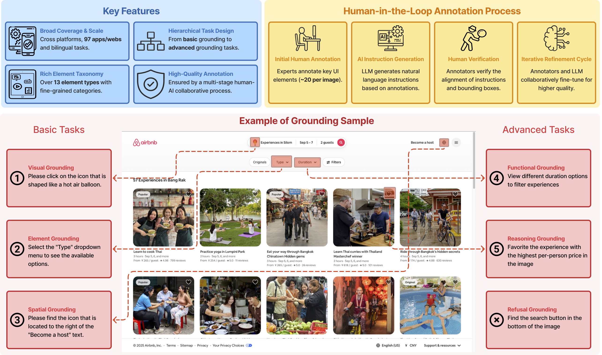

# VenusBench-GD: A Comprehensive Multi-Platform GUI Benchmark for Diverse Grounding Tasks

**This repository is the official evaluation implementation of VenusBench-GD.**

> [VenusBench-GD: A Comprehensive Multi-Platform GUI Benchmark for Diverse Grounding Tasks](https://arxiv.org/abs/2512.16501)  
> Beitong Zhou, Zhexiao Huang, Yuan Guo, Zhangxuan Gu, Tianyu Xia, Zichen Luo, Fei Tang, Dehan Kong, Yanyi Shang, Suling Ou, Zhenlin Guo, Changhua Meng, Shuheng Shen

## Introduction
VenusBench-GD is a comprehensive, multi-platform GUI grounding benchmark designed to address the limitations of scale, diversity, and annotation quality in existing datasets by covering 97 applications across desktop, mobile, and web environments with 6,166 bilingual samples. We introduce a hierarchical evaluation framework that splits grounding into **Basic tasks** and **Advanced tasks** to rigorously test agent capabilities.



## 💫 Dataset Access

The latest version of VenusBench-GD is hosted on [Huggingface](https://huggingface.co/datasets/inclusionAI/VenusBench-GD). 

Clone the entire dataset from Huggingface:

```shell
git clone https://huggingface.co/datasets/inclusionAI/VenusBench-GD
```
Make sure your screenshots are organized in the following structure:


```
VenusBench-GD/
├── instruction/                     # Dataset annotations
│   ├── element_grounding.json
│   ├── spatial_grounding.json
│   ├── visual_grounding.json
│   ├── reasoning_grounding.json
│   ├── functional_grounding.json
│   └── refusal_spatial.json
├── images/                         # Dataset images
│   ├── web/
│   └── mobile/
│   └── desktop/
├── assets/
├── meta.json
└── README.md
```

## 🚀 Benchmark Evaluation

### Installation

First, install the required dependencies:

```bash
pip install -r requirements.txt
```

### Supported Models

For a complete list of supported models, please refer to `models/__init__.py`. Currently supported models include:
- UI-Venus-Ground (7B & 72B)
- Qwen2.5-VL series
- Qwen3-VL series
- InternVL series
- UI-TARS series
- And many more...

### Running Evaluation

#### Single GPU Evaluation

To run evaluation on a single GPU:

```bash
bash scripts/run_eval.sh
```

#### Multi-GPU Evaluation with DDP

For faster evaluation using multiple GPUs:

```bash
bash scripts/run_eval_ddp.sh
```

### Parameters

- `--model_type`: Model identifier from `models/__init__.py`
- `--model_name_or_path`: Path to model weights or HuggingFace model ID
- `--images_dir`: Directory containing benchmark images
- `--anns_dir`: Directory containing annotation JSON files
- `--task`: Task to evaluate (`all` for all tasks, or specific task names separated by commas)
- `--language`: Language for instructions (`en`, `cn`, or `all`)
- `--gt_type`: Ground truth type (`positive`, `negative`, or `all`)
- `--log_path`: Path to save evaluation results
- `--inst_style`: Instruction style (`instruction`, `action`, `description`, or `all`)

### Evaluation Results

Results will be saved as a JSON file containing:
- Overall metrics (accuracy, text/icon breakdown)
- Fine-grained metrics by platform, application, and task type
- Detailed per-sample predictions and correctness

## 🖊️ Citation 
If you feel VenusBench-GD useful in your project or research, please kindly use the following BibTeX entry to cite our paper. Thanks!
```bib
@misc{zhou2025venusbenchgdcomprehensivemultiplatformgui,
      title={VenusBench-GD: A Comprehensive Multi-Platform GUI Benchmark for Diverse Grounding Tasks}, 
      author={Beitong Zhou and Zhexiao Huang and Yuan Guo and Zhangxuan Gu and Tianyu Xia and Zichen Luo and Fei Tang and Dehan Kong and Yanyi Shang and Suling Ou and Zhenlin Guo and Changhua Meng and Shuheng Shen},
      year={2025},
      eprint={2512.16501},
      archivePrefix={arXiv},
      primaryClass={cs.CV},
      url={https://arxiv.org/abs/2512.16501}, 
}