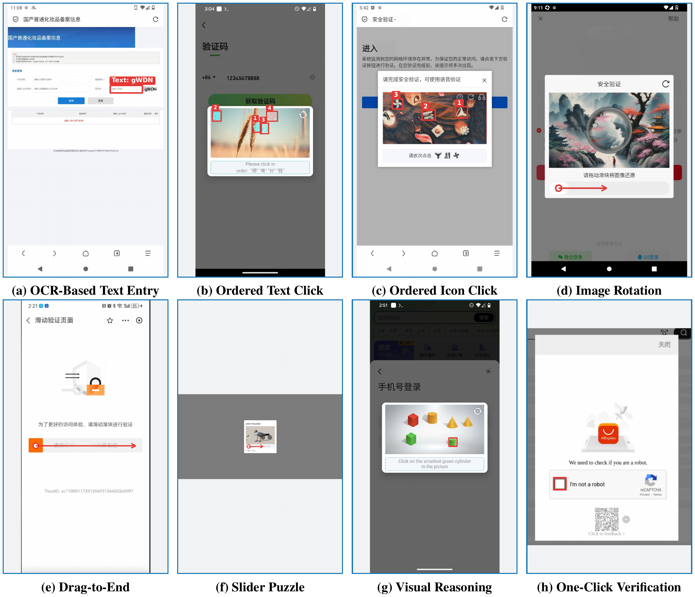

# VenusBench-CAPTCHA

<p align="center">
  <strong>A Real-World CAPTCHA Screenshot–Action Dataset for GUI Agents</strong>
</p>

<p align="center">
  
</p>

VenusBench-CAPTCHA is a static offline dataset for multimodal models and GUI agents. The current release contains **219 real-world CAPTCHA samples** across **8 challenge types**. Each sample includes a screenshot, conversational instructions, a reference action, the original image size, interaction regions, and an ordering constraint.

The dataset goes beyond isolated character recognition. It targets the complete set of capabilities a GUI agent needs to handle a CAPTCHA in a realistic interface: understanding the page and challenge instructions, recognizing visual targets, grounding them spatially, and producing executable `Click`, `Drag`, or `Type` actions.

> This dataset is intended only for authorized academic research, security evaluation, model robustness analysis, and defensive research. It must not be used to bypass access controls on online services or perform any unauthorized automation. See [Responsible Use and Disclaimer](#responsible-use-and-disclaimer).

## Motivation

CAPTCHA datasets and experiments often focus on a particular mechanism, provider, cropped challenge, or procedurally generated environment. These choices provide scale and experimental control, but openly usable real-world samples that combine interface context, a unified action language, and spatial annotations remain comparatively limited.

VenusBench-CAPTCHA follows a **real-world-first, unified-format, carefully curated** approach. It consolidates CAPTCHA samples from existing research resources and practical web or application scenarios into a single data structure. The dataset is designed to complement large synthetic datasets rather than replace online, dynamic, or behavior-based CAPTCHA evaluation.

The dataset is intended to support questions such as:

- Can a model locate a CAPTCHA in a complete or realistically presented interface instead of recognizing only pre-cropped characters?
- Can a model combine OCR, fine-grained visual recognition, semantic reasoning, spatial grounding, and drag control?
- Can a GUI agent convert a visual decision into an action sequence with the correct syntax and ordering?
- Which CAPTCHA types cause different models to fail, and when should an agent safely request human takeover?
- How can human-verification and automated abuse-prevention mechanisms be made more robust and usable?

## Dataset Overview

The current release contains 219 samples and 219 valid images. Every category contains 30 samples except `oneclick_login`, which contains 9.

| `captcha_type` | Samples | Description |
| --- | ---: | --- |
| `OCR` | 30 | Recognize CAPTCHA text or digits and enter the answer in the designated input area |
| `drag_end` | 30 | Drag a slider or control to a designated endpoint |
| `icon_click` | 30 | Select one or more target icons according to the instruction |
| `image_rotation` | 30 | Drag a rotation control until the image reaches the correct orientation |
| `oneclick_login` | 9 | Click a one-click verification, login, or confirmation area |
| `slider_puzzle` | 30 | Drag a puzzle piece until it aligns with the missing region |
| `text_click` | 30 | Click one or more text targets, sometimes in a required order |
| `visual_reasoning` | 30 | Select an answer using visual semantics, correspondence, or other visual rules |
| **Total** | **219** | |

Key properties include:

- **Real-world-first data**: samples include screenshots from web or application verification flows as well as CAPTCHA images preserved in their practical presentation form;
- **Diverse interactions**: the dataset covers single clicks, multi-target clicks, text entry, and dragging;
- **Unified conversation format**: every sample contains a `system → user` message sequence, with reference labels stored separately from the model input;
- **Unified action language**: reference answers use an action DSL suitable for GUI-agent training and evaluation;
- **Spatial annotations**: target rectangles in original-image pixel space support grounding evaluation and action visualization;
- **Portable paths**: image paths are relative to the annotation file and do not depend on machine-specific absolute paths.

## Repository Layout

```text
.
├── README.md
├── eval.py                         # Validation, batch inference, and scoring CLI
├── requirements-eval.txt
├── requirements-local.txt          # Local vLLM inference dependencies
├── assets/
│   └── venusbench_captcha_overview.png
├── evaluation/                     # Reusable evaluation package
│   ├── actions.py                  # Action-block extraction and DSL parsing
│   ├── backends/                   # Pluggable inference backends
│   ├── data.py                     # Dataset loading and preflight validation
│   ├── inference.py                # Concurrent, resumable inference
│   ├── metrics.py                  # Per-sample, micro, and macro metrics
│   ├── reporting.py                # Visual HTML report
│   └── scoring.py                  # Click, Type, and Drag judging
├── images/
│   ├── OCR/
│   ├── drag_end/
│   ├── icon_click/
│   ├── image_rotation/
│   ├── oneclick_login/
│   ├── slider_puzzle/
│   ├── text_click/
│   └── visual_reasoning/
├── instruction/
│   └── VenusBench-CAPTCHA.json
└── scripts/
    ├── run_eval_local.sh
    ├── run_eval_api.sh
    └── serve_vllm_api.sh
```

- `assets/` contains the dataset overview used in this README;
- `images/` contains the source images organized by `captcha_type`;
- `instruction/VenusBench-CAPTCHA.json` contains all 219 conversation and action annotations.

Each `captcha_type` exactly matches its directory name under `images/`. Every path in `images` is resolved relative to the annotation JSON, for example:

```text
../images/slider_puzzle/15_Slide.png
```

## Data Format

The annotation file is a JSON array. The following is an abbreviated representative sample:

```json
{
  "images": [
    "../images/slider_puzzle/15_Slide.png"
  ],
  "messages": [
    {
      "role": "system",
      "content": "<GUI-agent and CAPTCHA task prompt>"
    },
    {
      "role": "user",
      "content": "<image>"
    }
  ],
  "image_size": [
    450,
    850
  ],
  "captcha_type": "slider_puzzle",
  "action_raw": "Drag(start=(86, 351), end=(245, 351))",
  "action_raw_rect": [
    [
      65.40724758357439,
      331.07938001930466,
      107.37647205465454,
      372.49638199303223
    ]
  ],
  "inorder": false
}
```

### Field Reference

| Field | Type | Description |
| --- | --- | --- |
| `images` | `string[]` | Paths to input images; the current release contains one image per sample, resolved relative to the annotation JSON |
| `messages` | `object[]` | Model-input conversation containing only the `system` and `user` roles; reference answers are intentionally not embedded in the message sequence |
| `image_size` | `[number, number]` | Original image dimensions in `[width, height]` order |
| `captcha_type` | `string` | CAPTCHA category, identical to the corresponding image directory name |
| `action_raw` | `string` | Reference action without the outer `<action>` tag; spatial values in this 219-sample release are original-image pixels |
| `action_raw_rect` | `number[][]` | Rectangles associated with interaction targets, formatted as `[x1, y1, x2, y2]` in original-image pixel coordinates |
| `inorder` | `boolean` | Whether multiple actions or targets must be executed in the annotated order |

The `messages` array intentionally contains no assistant turn, which keeps the reference answer out of the model input. Ground-truth actions remain available separately in `action_raw` and `action_raw_rect`.

When a downstream evaluator needs to convert an `action_raw` value from original-image pixels to the system prompt's 0–999 coordinate space, use:

```python
x_999 = round(x_raw * 999 / image_width)
y_999 = round(y_raw * 999 / image_height)
```

For example, the representative sample above retains `Drag(start=(86, 351), end=(245, 351))` in `action_raw`; its normalized form is `Drag(start=(191, 413), end=(544, 413))`. Non-spatial payloads such as the text passed to `Type` are unchanged.

Reference answers currently use these action forms:

```text
Click(box=(x, y))
Click(box=(x, y)),Click(box=(x, y))
Click(box=(x, y)),Type(content='text')
Drag(start=(x1, y1), end=(x2, y2))
```

`action_raw` and `action_raw_rect` use original-image pixel coordinates in this
release. Model predictions use the system prompt's `[0, 999]` coordinate space
by default and are denormalized before scoring.

## Loading the Dataset

No dataset-specific Python package is required. The following example loads the annotations and resolves an image path:

```python
import json
from pathlib import Path

annotation_path = Path("instruction/VenusBench-CAPTCHA.json")
samples = json.loads(annotation_path.read_text(encoding="utf-8"))

sample = samples[0]
image_path = (annotation_path.parent / sample["images"][0]).resolve()

print("samples:", len(samples))
print("type:", sample["captcha_type"])
print("image:", image_path)
print("roles:", [message["role"] for message in sample["messages"]])
print("raw action:", sample["action_raw"])
```

To count samples by category:

```python
from collections import Counter

counts = Counter(sample["captcha_type"] for sample in samples)
print(counts)
```

## Benchmark Evaluation

The repository includes a standalone evaluation toolkit. Dataset loading, model
backends, deterministic scoring, and reporting are implemented as separate
components. It supports batched local inference through the vLLM Python API and
concurrent requests to an OpenAI-compatible Chat Completions endpoint, including
a separately served local vLLM model. Predictions produced by another inference
stack can also be scored without calling a model again.

### Installation and Data Validation

Python 3.10 or newer is required. Core scoring and API inference remain
lightweight; Pillow is used to decode images during the integrity preflight.
Install the core dependencies first to validate or score the dataset:

```bash
python -m pip install -r requirements-eval.txt
python eval.py validate
```

Direct local inference additionally requires vLLM and a compatible CUDA
environment:

```bash
python -m pip install -r requirements-local.txt
```

Install a vLLM build compatible with the machine's CUDA driver and PyTorch
runtime. API-only evaluation does not require vLLM in the evaluator process.

The validation command checks required fields, positive image dimensions,
finite in-bounds bounding boxes, supported discovered actions, and point/text
action-to-box cardinality before any model request is made. Unless image checks
are skipped, it also verifies image existence, decoding, and dimensions. Image
paths are resolved relative to the annotation JSON, not the current working
directory. Use `--skip-image-check` only when validating labels in an
environment where the images are intentionally unavailable. The current
preflight does not fully consume every character of `action_raw` or verify every
ground-truth action coordinate against its rectangle.

### Local vLLM Inference and Evaluation

Pass either a local checkpoint directory or a Hugging Face model identifier.
The default backend creates one vLLM engine and submits multimodal conversations
through batched `LLM.chat()` calls:

```bash
python eval.py run \
  --backend vllm \
  --model-name-or-path /path/to/vision-language-model \
  --tensor-parallel 1 \
  --batch-size 32 \
  --max-model-len 50000 \
  --presence-penalty 0 \
  --drag-dist-rel-tol 0.05 \
  --concurrency 1 \
  --predictions results/captcha-model.jsonl \
  --resume
```

Local vLLM inference keeps `--concurrency 1` because batching is performed by
the engine rather than request threads. Increase `--batch-size` for larger
offline batches and `--tensor-parallel` when one model replica spans multiple
GPUs. Useful loading controls include `--gpu-memory-utilization`, `--dtype`,
`--revision`, `--min-pixels`, and `--max-pixels`. When a Hugging Face model ID
is used with `--resume`, set `--revision` to an immutable commit SHA so a moving
Hub branch cannot silently change the model. Use `--trust-remote-code` only for
a checkpoint whose repository code you have reviewed and trust.

The convenience script reads the checkpoint from `MODEL_NAME_OR_PATH`:

```bash
MODEL_NAME_OR_PATH=/path/to/vision-language-model \
bash scripts/run_eval_local.sh
```

The script defaults to `--resume`; append `--overwrite` when intentionally
starting the same output path from scratch.

The model receives the dataset's original system/user instructions and image
through its multimodal chat template. Its decoded response is saved as
`model_output` and evaluated with the same action-block parser and scoring rules
used for imported predictions. Each completed local batch is persisted before
the next batch starts.

API inference is bounded by `--concurrency`; local vLLM inference is bounded by
`--batch-size`. Completed records are appended and synchronized to disk, and the
final file is reordered by the original annotation index. `--resume` verifies
the annotation and selected image bytes, selected samples, evaluator version,
model, prompts, backend-specific loading or endpoint settings, and generation
configuration before skipping durable records. Existing local checkpoint files
are also fingerprinted, preventing accidental mixtures after weights are
replaced under the same path. An incomplete final JSONL write is discarded
safely; corruption in an earlier record remains a hard error. Resume also skips
persisted inference failures, so use a new output path or `--overwrite` to rerun
every sample after changing model or server conditions.

The resume signature does not currently bind transport concurrency, timeout,
retry count, or scoring tolerances. Use a separate predictions path when those
policies change instead of mixing old and new records in one resumed run.

Useful subset controls include `--types OCR text_click`,
`--sample-indices 0 7 18`, and `--limit 20`.

### vLLM/OpenAI-Compatible API Backend

To serve a local checkpoint with the same default context length, start vLLM in
one terminal:

```bash
MODEL_NAME_OR_PATH=/path/to/vision-language-model \
SERVED_MODEL_NAME=captcha-model \
MAX_MODEL_LEN=50000 \
bash scripts/serve_vllm_api.sh
```

`--max-model-len` is an engine/server setting. It is applied by the local vLLM
backend and `serve_vllm_api.sh`, but it is intentionally not sent inside a Chat
Completions request. Then run the API client in another terminal:

```bash
python eval.py run \
  --backend openai-compatible \
  --base-url http://127.0.0.1:8000/v1 \
  --model captcha-model \
  --concurrency 4 \
  --max-retries 0 \
  --presence-penalty 0 \
  --drag-dist-rel-tol 0.05 \
  --predictions results/captcha-model-api.jsonl \
  --resume
```

For a hosted endpoint, set `OPENAI_API_KEY` in the environment or pass
`--api-key`. Credentials are never written to predictions, manifests, metrics,
or reports; endpoint paths/queries and extra request bodies are fingerprinted
rather than stored verbatim. `--enable-thinking` passes the vLLM/Qwen-style
`chat_template_kwargs.enable_thinking=true`; omit it for servers that do not
use this extension. Additional provider parameters can be supplied with
`--extra-body-json` or `--extra-body-file`. For comparable `pass@1` results, do
not supply `n>1`, `best_of`, or another provider option that generates or
selects among multiple candidates.

The convenience script accepts the same endpoint through environment variables:

```bash
MODEL=captcha-model \
BASE_URL=http://127.0.0.1:8000/v1 \
bash scripts/run_eval_api.sh --max-retries 0
```

The API script also accepts `ANNOTATIONS`, `PREDICTIONS`, `CONCURRENCY`,
`MAX_TOKENS`, `TEMPERATURE`, `TOP_P`, `TOP_K`, `PRESENCE_PENALTY`, and `SEED`
as environment variables. Its default concurrency is `32`; the direct CLI
default is `1`. Like the local script, it defaults to `--resume`; pass
`--overwrite` only when intentionally replacing the selected predictions path.

The API CLI defaults to `--max-retries 3`. Retryable network failures,
HTTP 408/409/425/429/5xx responses, and structurally invalid responses may
therefore issue another request. A structurally valid response with empty or
whitespace-only content is terminal and is never retried. Use
`--max-retries 0`, as in the examples above, when the evaluation policy requires
one HTTP request attempt per sample. A process interruption before a response is
durably written can still cause that unfinished sample to run again after
`--resume`; never run two evaluators concurrently against the same predictions
path.

### Scoring Existing Predictions

Predictions from another inference stack can be scored independently. JSONL is
recommended; records are joined by `sample_id` or by the original zero-based
`sample_index`:

```json
{"sample_index": 0, "model_output": "<action>Drag(start=(155,556),end=(890,556))</action>"}
```

```bash
python eval.py score \
  --predictions path/to/predictions.jsonl \
  --annotations instruction/VenusBench-CAPTCHA.json
```

JSON arrays and result rows containing `_source_index` are also accepted. When
all records contain no id or index, they are aligned by file order. Keyed and
unkeyed rows cannot be mixed in one file because that would make alignment
ambiguous. Missing predictions remain in the full denominator rather than
being silently dropped.

By default, scoring writes three sibling files:

- `*.metrics.json`: machine-readable configuration, dataset SHA-256, micro
  `pass@1`, unweighted macro `pass@1` over the selected CAPTCHA types,
  per-category/per-interaction metrics, status counts, and failure reasons
  (the full 219-sample benchmark contains eight types);
- `*.scored.jsonl`: one persisted status, reason, and parsed action list per
  sample;
- `*.report.html`: a self-contained visual report with ground-truth boxes,
  predicted points/drags, compact numbered prediction markers for ordered
  clicks, and type/status filters. Use `--no-html` when only machine-readable
  outputs are needed.

`pass_at_1` is the benchmark metric. The JSON also retains `accuracy` as an
equivalent compatibility alias and `valid_accuracy` as a diagnostic that omits
inference failures; `valid_accuracy` must not be reported as benchmark
`pass@1`. The terminal summary and HTML report display only `pass@1`.

### Scoring Rules

The primary metric is `pass@1`, calculated as correct samples divided by all
selected samples. Missing predictions, API failures, empty responses, and parse
errors remain in the denominator. Each sample accepts one prediction record;
API and local backends score only the first candidate in a structurally valid
returned response and never choose the best-scoring candidate. This is
completion-level `pass@1`, not necessarily a guarantee that only one HTTP
request occurred; see the retry policy above.

Once an API returns a structurally valid completion, empty or whitespace-only
content is terminal and scores as `empty_response`; it is never resampled.
The complete action sequence in that one completion is scored as a unit, so a
required `Click+Type` or multi-click sequence is still one Top-1 answer. Every
prediction must contain exactly one complete `<action>...</action>` block, and
only that block's contents are parsed. Surrounding text and `<think>` markup
are ignored rather than validated. Missing, extra, malformed, nested, or
repeated action blocks fail the sample; unsupported function-like actions inside
the block also fail. The current parser extracts recognized action calls rather
than requiring every character inside the block to be DSL syntax, so prediction
producers should place only executable actions and separators inside
`<action>`.

| Interaction | Rule |
| --- | --- |
| Click / LongPress | Action type and count must match, and separate point actions must be at least one original-image pixel apart. `inorder=true` uses positional point-to-rectangle matching; otherwise the complete prediction must admit a one-to-one matching to all target rectangles. Intersecting rectangles can produce more than one valid assignment. |
| Click + Type | Every text action must be paired with the immediately preceding Click. Clicks use the same one-pixel separation and target-matching rules. Text comparison is case-sensitive after `.strip()`, so leading and trailing whitespace is ignored. |
| Drag | Exactly one Drag is required. With the canonical defaults, its start must hit the annotated start rectangle, signed horizontal displacement error must be strictly below `0.05`, and endpoint-y error must be strictly below `5` original-image pixels. Reverse drags fail. |

The default prediction coordinate space is `[0, 999]`. Before hit testing, the
evaluator converts model coordinates back to original-image pixels:

```text
x_pixel = x_pred * image_width  / 999
y_pixel = y_pred * image_height / 999
```

For offline `score`, use `--coord-scale 1` for `[0, 1]` model outputs or
`--coord-scale 0` for absolute pixels. For `run`, any non-default coordinate
scale also requires `--system-prompt` or `--system-prompt-file` whose output
instructions use that same scale; this guard prevents silently scoring the
dataset's default `[0, 999]` prompt under a different coordinate system. Drag
tolerances can be changed explicitly with `--drag-dist-rel-tol` (alias
`--drag-distance-rel-tolerance`) and `--drag-y-tol` (alias
`--drag-y-tolerance`); the selected values are persisted in the metrics file.
The CLI accepts any positive finite tolerance for diagnostic experiments, but
results produced with values other than the canonical `0.05` and `5` must not
be presented as directly comparable benchmark scores. For comparable benchmark
reporting, report
both full-set micro `pass@1` and the macro-average `pass@1` across all eight
`captcha_type` categories.

## Recommended Uses

- Offline evaluation of multimodal models and GUI agents;
- CAPTCHA detection, classification, OCR, visual reasoning, and spatial-grounding research;
- Supervised learning or small-scale validation of click, drag, and text-entry actions;
- Failure analysis, calibration, safe refusal, and human-takeover research;
- CAPTCHA usability, robustness, and defensive security research.

For model comparisons, we recommend reporting `pass@1` for each `captcha_type` and a macro-average across categories so that the smaller `oneclick_login` category does not distort the overall conclusion. If creating custom training and test splits, check for visually similar or same-source samples first to prevent near-duplicate leakage across splits.

## Limitations

- The current release contains only 219 samples. It is suitable for evaluation, error analysis, and small-scale research, but should not be described as a large-scale training corpus;
- This is static screenshot–action data. It does not include live backends, challenge refreshes, execution feedback, failure recovery, or final verification tokens;
- The categories are not perfectly balanced: `oneclick_login` currently contains only 9 samples;
- CAPTCHA and page designs change over time. This snapshot cannot represent every region, device, provider, or future deployment;
- Samples were consolidated from different sources and interface formats, so image resolution, crop range, and coordinate handling vary;
- Bounding-box scoring verifies that a valid one-to-one assignment exists; overlapping rectangles do not provide unique target identity or pixel-level masks;
- The action wrapper and supported function set are validated, but arbitrary non-function prose inside a valid `<action>` block is currently ignored rather than rejected as residual syntax;
- API retries and crash recovery improve robustness but cannot prove that a remote server generated exactly one candidate unless retries are disabled and the run completes without an uncommitted interruption;
- Annotations may contain noise, ambiguity, or omissions. Research results should be accompanied by human inspection and should disclose the dataset version and evaluation rules used.

This dataset is not a substitute for end-to-end security evaluation in a real online environment. Results on this dataset alone must not be used to claim that a model can reliably pass or defend production CAPTCHA systems.

## Responsible Use and Disclaimer

This repository is intended to advance research on GUI agents, security evaluation, usability, and defensive technology. Anyone accessing or using the dataset is responsible for ensuring that their activity is properly authorized and complies with applicable laws, website or application terms of service, and institutional research-ethics requirements.

The dataset must not be used for:

- Bypassing CAPTCHAs, risk controls, or access controls on production systems without authorization;
- Bulk account creation, spam, malicious scraping, credential attacks, fraud, or other abuse;
- Evading platform restrictions, disrupting service availability, or infringing the rights of others;
- Identifying, linking, or reusing any personal, account, or device information that may appear in screenshots.

The dataset may contain third-party interfaces, text, trademarks, brands, or copyrighted visual elements. All such rights remain with their respective owners. Inclusion in this research dataset does not imply sponsorship, endorsement, or partnership, and it does not grant any additional rights to third-party content. Users are responsible for obtaining any permissions required before displaying, redistributing, or commercially using the data.

The dataset is provided **as is**, without express or implied warranties of accuracy, completeness, merchantability, fitness for a particular purpose, or non-infringement. To the extent permitted by law, the maintainers are not liable for direct or indirect loss arising from use of, or inability to use, the dataset. Users assume responsibility for risks and obligations arising from their research, deployment, and data-processing activities.

If a rights holder believes that any repository content should not be public, or if you discover a privacy, annotation, attribution, or other issue, please open a repository issue with the specific file path and an explanation. The maintainers will review verified requests and take appropriate action.

### Data License

The repository currently does not include a separate data-license file. **Public availability does not constitute an unrestricted license.** Until a formal `LICENSE` or Data License is added, contact the maintainers before redistributing the dataset, creating derivative datasets, or using it commercially. Any future license covering project-owned material will not automatically cover rights held by third parties.

## Citation

If you find this dataset useful, please cite the following paper:

```bibtex
@misc{venusteam2026uivenus2technicalreport,
      title={UI-Venus-2 Technical Report},
      author={Venus Team and Zhuohan Cai and Haoxing Chen and Jiaxuan Chen and Weizhi Chen and Changlong Gao and Zhangxuan Gu and Yuan Guo and Yusong Hu and Jianrong Jiang and Jianguo Li and Runze Li and Jinzhen Lin and Zhenyu Ma and Changhua Meng and Han Peng and Xinyu Qiu and Shuheng Shen and Zhongyi Shui and Weiqiang Wang and Ming Wen and Zhuoer Xu and Hang Yan and Kaiwen Yang and Ruilin Yao and Nanjun Yu and Zhengwen Zeng and Lianrui Zhang and Yunzhu Zhang and Zhe Zhao and Beitong Zhou},
      year={2026},
      eprint={2609.00028},
      archivePrefix={arXiv},
      primaryClass={cs.AI},
      url={https://arxiv.org/abs/2609.00028},
}
```
