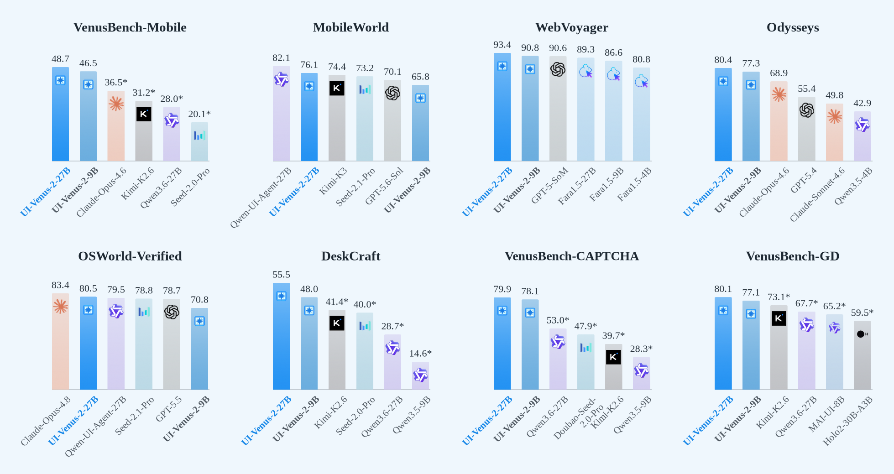
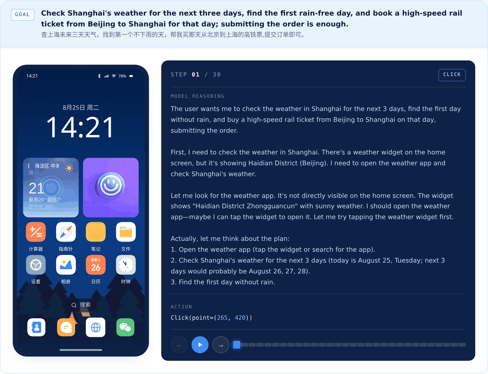

<h1 align="center">
   UI-Venus-2
</h1>

<p align="center">
  <a href="./README.md">English</a> | <strong>简体中文</strong>
</p>

<p align="center">
  <a href="https://opensource.org/licenses/Apache-2.0"></a>
  
  <a href="https://ui-venus.github.io/UI-Venus-2"></a>
  <a href="https://github.com/inclusionAI/UI-Venus"></a>
  <a href="https://huggingface.co/inclusionAI/UI-Venus-2-9b"></a>
</p>

<p align="center">
  <em>一个面向移动应用、Web 平台和桌面操作系统的<strong>通用基础 GUI 智能体</strong>——在单一的感知—推理—动作闭环智能体中，联合扩展<strong>环境、任务与反馈</strong>。</em>
</p>

## 🌟 UI-Venus-2 新特性

相较于 UI-Venus-1.5，我们引入了：

- 📱 **规模化的多语言移动环境：** 大幅扩展可执行移动应用池，覆盖中英文应用生态；同时采用**深度研究驱动的查询生成**策略，让任务查询以真实应用功能为依据，从而提升生成指令的准确性、有效性和可执行性。
- 🖥️ **从零构建的计算机操作能力：** 通过计算机操作数据采集和专项训练，从头构建桌面操作系统能力，使 UI-Venus 系列能够通过**一个统一的端到端智能体完成移动端、Web 和操作系统交互**。
- 🎯 **基于关键点的验证：** 不再粗略地整体观察最终画面，而是依据**与任务相关的视觉关键点**判断任务是否完成；同时通过**多模型投票**聚合不同类型的评判模型，减少单一评判模型的偏差，并增强奖励信号抵御奖励作弊（reward hacking）的能力。
- 🔄 **验证增强的反思：** 将经过验证的反馈提炼为训练中的**反思监督**，使智能体能够区分部分进展与真正完成，避免因错误理解观察结果而过早终止，并能在长程交互中恢复执行。

---

<p align="center">
  📈 <strong>UI-Venus-2 基准测试表现</strong>
</p>

<p align="center">
  
</p>

> **图** UI-Venus-2 在八项 GUI 智能体基准上的表现。每个面板将 UI-Venus-2-27B 和 UI-Venus-2-9B 与四个精选的强外部基线进行比较。我们优先选择在最接近的任务子集和步数预算下评测的独立端到端系统，但来源报告所使用的 action scaffold 仍可能存在差异。所有柱状图均从零开始，各面板的刻度范围不同。MobileWorld 使用 117 个任务、50 步设置下的纯 GUI 成功率；WebVoyager 使用更新后的 595 任务划分；Odysseys 使用 200 个任务的平均 rubric 分数；VenusBench-CAPTCHA 使用全部 219 个样例的 micro Pass@1；VenusBench-GD 使用英文指令的微平均准确率。在线网站结果可能随评测日期而变化。“*”表示由我们按照所述协议评测或复现的外部模型结果，并不表示统计显著性。

---

# 📰 最新动态

* [2026/08] 发布 **UI-Venus-2**：一款 9B/27B 通用基础 GUI 智能体，通过规模化多语言环境、基于关键点的验证和验证增强的反思，统一移动端、Web 和桌面端交互。
* [2026/02] 发布 **[UI-Venus-1.5](https://ui-venus.github.io/UI-Venus-1.5/)**：一款专为稳定执行真实世界应用任务而设计的端到端 GUI 智能体。
* [2026/02] 发布 **VenusBench-Mobile**：一个具有挑战性的移动端 GUI 智能体在线基准。参见 [VenusBench-Mobile 分支](https://github.com/inclusionAI/UI-Venus/tree/VenusBench-Mobile)。
* [2025/12] 发布 [VenusBench-GD](https://ui-venus.github.io/VenusBench-GD/)：一个全面的多平台 GUI 定位基准。参见 [VenusBench-GD 分支](https://github.com/inclusionAI/UI-Venus/tree/VenusBench-GD)。
* [2025/8] 发布 **[UI-Venus](https://github.com/inclusionAI/UI-Venus/tree/UI-Venus-1.0)**：我们的第一版 UI 智能体模型。

---

# 🧭 目录

* [演示](#-演示)
* [Venus 框架](#-venus-框架)
* [快速开始](#-快速开始)
* [基准测试结果](#-基准测试结果)
* [联系方式](#-联系方式)
* [引用](#-引用)

---

# ✨ 演示

[查看更多演示](https://ui-venus.github.io/UI-Venus-2/#demos)



---

# 🛠️ Venus 框架

我们提供了两套用于在真实环境中运行智能体的框架：

| 框架 | 说明 | 文档 |
|---|---|---|
| 移动端框架 | 基于 Android/ADB 的智能体框架，支持单任务执行、多设备批量执行、轨迹记录和反思。 | [中文](./Venus_framework/Venus_framework_mobile/README_CN.md) · [English](./Venus_framework/Venus_framework_mobile/README.md) |
| 浏览器插件 | 一款 Chrome 侧边栏扩展，可将 UI-Venus 连接到当前浏览器标签页并以交互方式执行浏览器任务。 | [中文](./Venus_framework/Venus_plugin_browser/README_CN.md) · [English](./Venus_framework/Venus_plugin_browser/README.md) |

目录结构和入口说明请参阅 [Venus 框架概览](./Venus_framework/README_CN.md)。除非各示例的要求另有说明，否则下方的轻量级领域示例无需依赖这两套框架。

---

# 🚀 快速开始

### 安装

```bash
conda create -n ui-venus-2 python=3.11 -y
conda activate ui-venus-2
pip install -r requirements.txt
```

需要 Python 3.10 或更高版本。以下所有命令均在仓库根目录执行。通过 `MODEL_URL`、`MODEL_NAME` 以及 `API_KEY` 或 `MODEL_API_KEY` 配置兼容 OpenAI 接口的模型服务；也可以在各领域脚本顶部修改相同配置。同时设置两个密钥变量时，`API_KEY` 的优先级更高。请将 `MODEL_NAME` 设置为部署 UI-Venus-2 9B 或 27B 模型时使用的服务名称。

### 移动端

使用仓库内预先录制的截图序列运行多轮推理。`N_IMG` 用于控制保留最近多少张历史截图：

```bash
MODEL_URL=http://127.0.0.1:8000/v1 \
MODEL_NAME=UI-Venus-2 \
N_IMG=2 \
bash scripts/mobile.sh
```

此示例仅执行模型推理，不会在设备上执行操作。如需通过 ADB 自动操作真实设备，请使用上方的移动端框架。

[移动端多轮示例及输入/输出格式](./models/mobile/README_CN.md)

### 计算机

使用预先录制的桌面截图序列运行多轮计算机操作推理：

```bash
MODEL_URL=http://127.0.0.1:8000/v1 \
MODEL_NAME=UI-Venus-2 \
N_IMG=2 \
bash scripts/computer.sh
```

默认命令使用仓库内附带的桌面截图样例。该独立示例会校验并规范化模型操作，但不会在宿主机上执行这些操作；运行时也不依赖 OSWorld。

[计算机多轮示例及操作格式](./models/computer/README_CN.md)

### 浏览器

按照领域文档的说明，以 CDP 端口启动 Chrome，然后运行一个自然语言浏览器任务：

```bash
MODEL_URL=http://127.0.0.1:8000/v1 \
MODEL_NAME=UI-Venus-2 \
bash scripts/browser.sh "打开 https://example.com 并报告页面标题"
```

[浏览器用法及 CDP 配置](./models/browser/README.md)

### 定位

在仓库内附带的三个样例上运行直接定位评测：

```bash
MODEL_URL=http://127.0.0.1:8000/v1 \
MODEL_NAME=UI-Venus-2 \
bash scripts/grounding.sh
```

[定位评测、冒烟测试及基准配置](./models/grounding/README.md)

### CAPTCHA

对仓库内附带的 CAPTCHA 图片运行推理，并将解析后的 JSON 和可视化结果保存到 `results/captcha/`：

```bash
MODEL_URL=http://127.0.0.1:8000/v1 \
MODEL_NAME=UI-Venus-2 \
bash scripts/captcha.sh
```

[CAPTCHA 用法、提示词、操作格式及可视化](./models/captcha/README_CN.md)

---

# 📊 基准测试结果

### Mobile

<div align="center">

<table>
  <thead>
    <tr>
      <th align="left"><sub>Models</sub></th>
      <th align="center"><sub>MobileGym</sub></th>
      <th align="center"><sub>VenusBench&#8209;Mobile</sub></th>
      <th align="center"><sub>AndroidWorld</sub></th>
      <th align="center"><sub>MobileWorld</sub></th>
      <th align="center"><sub>KnowUBench</sub></th>
      <th align="center"><sub>MemGUI</sub></th>
    </tr>
  </thead>
  <tbody>
    <tr>
      <td colspan="7" align="left"><sub><em>General&nbsp;VLMs</em></sub></td>
    </tr>
    <tr>
      <td align="left"><sub>Qwen3.5&#8209;9B</sub></td>
      <td align="center">9.0*</td>
      <td align="center">15.3*</td>
      <td align="center">57.8</td>
      <td align="center">18.0 (18.0)*</td>
      <td align="center">33.3</td>
      <td align="center">6.2*</td>
    </tr>
    <tr>
      <td align="left"><sub>Qwen3.6&#8209;27B</sub></td>
      <td align="center">24.6*</td>
      <td align="center">28.0*</td>
      <td align="center">70.3</td>
      <td align="center">36.8 (41.9)*</td>
      <td align="center">-</td>
      <td align="center">25.7*</td>
    </tr>
    <tr>
      <td align="left"><sub>Claude&#8209;Opus&#8209;4.6</sub></td>
      <td align="center">-</td>
      <td align="center">36.5*</td>
      <td align="center">-</td>
      <td align="center">44.5</td>
      <td align="center">-</td>
      <td align="center">-</td>
    </tr>
    <tr>
      <td align="left"><sub>Kimi&#8209;K2.6</sub></td>
      <td align="center">38.7*</td>
      <td align="center">31.2*</td>
      <td align="center">-</td>
      <td align="center">55.6</td>
      <td align="center">-</td>
      <td align="center">39.1</td>
    </tr>
    <tr>
      <td align="left"><sub>Kimi&#8209;K3</sub></td>
      <td align="center">-</td>
      <td align="center">-</td>
      <td align="center">-</td>
      <td align="center">74.4</td>
      <td align="center">-</td>
      <td align="center">-</td>
    </tr>
    <tr>
      <td align="left"><sub>Seed&#8209;2.0&#8209;Pro</sub></td>
      <td align="center">52.0</td>
      <td align="center">20.1*</td>
      <td align="center">-</td>
      <td align="center">63.2</td>
      <td align="center">51.6</td>
      <td align="center"><ins>65.6</ins>*</td>
    </tr>
    <tr>
      <td align="left"><sub>Seed&#8209;2.1&#8209;Pro</sub></td>
      <td align="center">-</td>
      <td align="center">-</td>
      <td align="center">-</td>
      <td align="center">73.2</td>
      <td align="center">-</td>
      <td align="center">-</td>
    </tr>
    <tr>
      <td align="left"><sub>GPT&#8209;5.6&#8209;Sol</sub></td>
      <td align="center">-</td>
      <td align="center">-</td>
      <td align="center">-</td>
      <td align="center">70.1</td>
      <td align="center">-</td>
      <td align="center">-</td>
    </tr>
    <tr>
      <td colspan="7" align="left"><sub><em>GUI&#8209;specific&nbsp;Models</em></sub></td>
    </tr>
    <tr>
      <td align="left"><sub>UI&#8209;Venus&#8209;1.5&#8209;8B</sub></td>
      <td align="center">18.4*</td>
      <td align="center">16.1</td>
      <td align="center">73.7</td>
      <td align="center">22.2*</td>
      <td align="center">26.0</td>
      <td align="center">3.9*</td>
    </tr>
    <tr>
      <td align="left"><sub>UI&#8209;Venus&#8209;1.5&#8209;30B&#8209;A3B</sub></td>
      <td align="center">21.5*</td>
      <td align="center">21.5</td>
      <td align="center">77.6</td>
      <td align="center">17.1</td>
      <td align="center">-</td>
      <td align="center">10.9*</td>
    </tr>
    <tr>
      <td align="left"><sub>GUI&#8209;Owl&#8209;1.5&#8209;32B&#8209;Instruct</sub></td>
      <td align="center">20.3*</td>
      <td align="center">-</td>
      <td align="center">69.8</td>
      <td align="center">43.9</td>
      <td align="center">-</td>
      <td align="center">10.9</td>
    </tr>
    <tr>
      <td align="left"><sub>MAI&#8209;UI&#8209;8B</sub></td>
      <td align="center">21.5*</td>
      <td align="center">12.7</td>
      <td align="center">70.7</td>
      <td align="center">27.5</td>
      <td align="center">26.0</td>
      <td align="center">17.2*</td>
    </tr>
    <tr>
      <td align="left"><sub>Qwen&#8209;UI&#8209;Agent&#8209;27B</sub></td>
      <td align="center">-</td>
      <td align="center">-</td>
      <td align="center">-</td>
      <td align="center"><strong>82.1 (85.5)</strong></td>
      <td align="center">-</td>
      <td align="center">-</td>
    </tr>
    <tr>
      <td colspan="7" align="left"><sub><em>Ours</em></sub></td>
    </tr>
    <tr>
      <td align="left"><sub><strong>UI&#8209;Venus&#8209;2&#8209;9B</strong></sub></td>
      <td align="center"><ins>52.7</ins></td>
      <td align="center"><ins>46.5</ins></td>
      <td align="center"><ins>80.2</ins></td>
      <td align="center">65.8 (75.2)</td>
      <td align="center"><ins>56.5</ins></td>
      <td align="center">62.6</td>
    </tr>
    <tr>
      <td align="left"><sub><strong>UI&#8209;Venus&#8209;2&#8209;27B</strong></sub></td>
      <td align="center"><strong>60.5</strong></td>
      <td align="center"><strong>48.7</strong></td>
      <td align="center"><strong>84.0</strong></td>
      <td align="center"><ins>76.1 (82.9)</ins></td>
      <td align="center"><strong>59.7</strong></td>
      <td align="center"><strong>70.3</strong></td>
    </tr>
  </tbody>
</table>

</div>

> 各类移动端 GUI 基准的性能对比。VenusBench-Mobile 报告其 149 个任务主池上的成功率。MobileWorld 报告 117 个纯 GUI 任务在 50 步设置下的成功率；括号中的数值（如有）使用 100 步设置。MemGUI 报告主结果的 Pass@1。`*` 表示由我们评测或复现的外部模型结果，并不表示统计显著性。

### Computer

<div align="center">

<table>
  <thead>
    <tr>
      <th align="left"><sub>Models</sub></th>
      <th align="center"><sub>OSWorld&#8209;Verified</sub></th>
      <th align="center"><sub>OSWorld&#8209;V2</sub></th>
      <th align="center"><sub>DeskCraft</sub></th>
    </tr>
  </thead>
  <tbody>
    <tr>
      <td colspan="4" align="left"><sub><em>General&nbsp;VLMs</em></sub></td>
    </tr>
    <tr>
      <td align="left"><sub>Claude&#8209;Opus&#8209;4.8</sub></td>
      <td align="center"><strong>83.4</strong></td>
      <td align="center">-</td>
      <td align="center">-</td>
    </tr>
    <tr>
      <td align="left"><sub>Qwen3.5&#8209;9B</sub></td>
      <td align="center">41.8</td>
      <td align="center">2.5</td>
      <td align="center">14.6*</td>
    </tr>
    <tr>
      <td align="left"><sub>Qwen3.6&#8209;27B</sub></td>
      <td align="center">62.0</td>
      <td align="center">3.8</td>
      <td align="center">28.7*</td>
    </tr>
    <tr>
      <td align="left"><sub>Kimi&#8209;K2.6</sub></td>
      <td align="center">73.1</td>
      <td align="center">7.1</td>
      <td align="center">41.4*</td>
    </tr>
    <tr>
      <td align="left"><sub>Seed&#8209;2.0&#8209;Pro</sub></td>
      <td align="center">62.3</td>
      <td align="center">6.3</td>
      <td align="center">40.0*</td>
    </tr>
    <tr>
      <td align="left"><sub>Seed&#8209;2.1&#8209;Pro</sub></td>
      <td align="center">78.8</td>
      <td align="center">-</td>
      <td align="center">-</td>
    </tr>
    <tr>
      <td align="left"><sub>GPT&#8209;5.5</sub></td>
      <td align="center">78.7</td>
      <td align="center">-</td>
      <td align="center">-</td>
    </tr>
    <tr>
      <td colspan="4" align="left"><sub><em>GUI&#8209;specific&nbsp;Models</em></sub></td>
    </tr>
    <tr>
      <td align="left"><sub>GUI&#8209;Owl&#8209;1.5&#8209;32B&#8209;Instruct</sub></td>
      <td align="center">56.5</td>
      <td align="center">-</td>
      <td align="center">-</td>
    </tr>
    <tr>
      <td align="left"><sub>Qwen&#8209;UI&#8209;Agent&#8209;27B</sub></td>
      <td align="center">79.5</td>
      <td align="center">-</td>
      <td align="center">-</td>
    </tr>
    <tr>
      <td colspan="4" align="left"><sub><em>Ours</em></sub></td>
    </tr>
    <tr>
      <td align="left"><sub><strong>UI&#8209;Venus&#8209;2&#8209;9B</strong></sub></td>
      <td align="center">70.8</td>
      <td align="center">7.52</td>
      <td align="center">48.0</td>
    </tr>
    <tr>
      <td align="left"><sub><strong>UI&#8209;Venus&#8209;2&#8209;27B</strong></sub></td>
      <td align="center"><ins>80.5</ins></td>
      <td align="center">13.24</td>
      <td align="center">55.5</td>
    </tr>
  </tbody>
</table>

</div>

> 各类计算机使用智能体基准的性能对比。OSWorld-Verified 基线采用其引用来源中的 361 个任务设置，并可能使用各模型特定的 action scaffold。对于 DeskCraft，我们报告 Standard 和 Interactive 两个划分合计 538 个任务上由作者评测的汇总结果；这一口径与基准官方按划分报告的方式不同。`*` 表示由我们评测的外部模型结果，并不表示统计显著性。

### Browser

<div align="center">

<table>
  <thead>
    <tr>
      <th align="left"><sub>Models</sub></th>
      <th align="center"><sub>WebVoyager</sub></th>
      <th align="center"><sub>Online&#8209;Mind2Web</sub></th>
      <th align="center"><sub>REAL</sub></th>
      <th align="center"><sub>Odysseys&nbsp;Avg.</sub></th>
      <th align="center"><sub>Odysseys&nbsp;Perfect</sub></th>
    </tr>
  </thead>
  <tbody>
    <tr>
      <td colspan="6" align="left"><sub><em>General&nbsp;VLMs</em></sub></td>
    </tr>
    <tr>
      <td align="left"><sub>Qwen3.5&#8209;9B</sub></td>
      <td align="center">46.9*</td>
      <td align="center">27.3*</td>
      <td align="center">18.2*</td>
      <td align="center">42.6*</td>
      <td align="center">13.5*</td>
    </tr>
    <tr>
      <td align="left"><sub>Qwen3.5&#8209;4B</sub></td>
      <td align="center">-</td>
      <td align="center">-</td>
      <td align="center">-</td>
      <td align="center">42.9</td>
      <td align="center">10.7</td>
    </tr>
    <tr>
      <td align="left"><sub>Qwen3.6&#8209;27B</sub></td>
      <td align="center">84.3*</td>
      <td align="center">55.3*</td>
      <td align="center">27.3*</td>
      <td align="center">39.5*</td>
      <td align="center">18.5*</td>
    </tr>
    <tr>
      <td align="left"><sub>OpenAI&nbsp;Operator</sub></td>
      <td align="center">87.0</td>
      <td align="center">61.3</td>
      <td align="center">-</td>
      <td align="center">-</td>
      <td align="center">-</td>
    </tr>
    <tr>
      <td align="left"><sub>GPT&#8209;5&nbsp;(SoM)</sub></td>
      <td align="center">90.6</td>
      <td align="center">-</td>
      <td align="center">-</td>
      <td align="center">-</td>
      <td align="center">-</td>
    </tr>
    <tr>
      <td align="left"><sub>GPT&#8209;5.4</sub></td>
      <td align="center">-</td>
      <td align="center">-</td>
      <td align="center">-</td>
      <td align="center">55.4</td>
      <td align="center">33.5</td>
    </tr>
    <tr>
      <td align="left"><sub>Seed2.0&nbsp;Pro</sub></td>
      <td align="center">85.1*</td>
      <td align="center">68.5*</td>
      <td align="center">74.4*</td>
      <td align="center">60.2*</td>
      <td align="center">30.1*</td>
    </tr>
    <tr>
      <td align="left"><sub>GLM&#8209;5V&#8209;Turbo</sub></td>
      <td align="center">88.5</td>
      <td align="center">-</td>
      <td align="center">-</td>
      <td align="center">-</td>
      <td align="center">-</td>
    </tr>
    <tr>
      <td align="left"><sub>Claude&nbsp;Opus&nbsp;4.6</sub></td>
      <td align="center">88.0</td>
      <td align="center">-</td>
      <td align="center">-</td>
      <td align="center">68.9</td>
      <td align="center">44.5</td>
    </tr>
    <tr>
      <td align="left"><sub>Claude&#8209;Sonnet&#8209;4.6</sub></td>
      <td align="center">-</td>
      <td align="center">-</td>
      <td align="center">-</td>
      <td align="center">49.8</td>
      <td align="center">31.0</td>
    </tr>
    <tr>
      <td align="left"><sub>Kimi&#8209;K2.6</sub></td>
      <td align="center">76.8*</td>
      <td align="center">-</td>
      <td align="center">74.4*</td>
      <td align="center">-</td>
      <td align="center">-</td>
    </tr>
    <tr>
      <td colspan="6" align="left"><sub><em>GUI&#8209;specific&nbsp;Models</em></sub></td>
    </tr>
    <tr>
      <td align="left"><sub>UI&#8209;TARS&#8209;1.5</sub></td>
      <td align="center">84.8</td>
      <td align="center"><ins>75.8</ins></td>
      <td align="center">-</td>
      <td align="center">-</td>
      <td align="center">-</td>
    </tr>
    <tr>
      <td align="left"><sub>UI&#8209;Venus&#8209;1.5&#8209;30B&#8209;A3B</sub></td>
      <td align="center">76.0</td>
      <td align="center">-</td>
      <td align="center">38.0*</td>
      <td align="center">-</td>
      <td align="center">-</td>
    </tr>
    <tr>
      <td align="left"><sub>GUI&#8209;Owl&#8209;1.5&#8209;32B&#8209;Thinking</sub></td>
      <td align="center">82.1</td>
      <td align="center">-</td>
      <td align="center">44.6*</td>
      <td align="center">-</td>
      <td align="center">-</td>
    </tr>
    <tr>
      <td align="left"><sub>MolmoWeb&#8209;8B</sub></td>
      <td align="center">78.2</td>
      <td align="center">35.3</td>
      <td align="center">-</td>
      <td align="center">-</td>
      <td align="center">-</td>
    </tr>
    <tr>
      <td align="left"><sub>Fara1.5&#8209;4B</sub></td>
      <td align="center">80.8</td>
      <td align="center">-</td>
      <td align="center">-</td>
      <td align="center">-</td>
      <td align="center">-</td>
    </tr>
    <tr>
      <td align="left"><sub>Fara1.5&#8209;9B</sub></td>
      <td align="center">86.6</td>
      <td align="center">63.4</td>
      <td align="center">-</td>
      <td align="center">-</td>
      <td align="center">-</td>
    </tr>
    <tr>
      <td align="left"><sub>Fara1.5&#8209;27B</sub></td>
      <td align="center">89.3</td>
      <td align="center">72.3</td>
      <td align="center">-</td>
      <td align="center">-</td>
      <td align="center">-</td>
    </tr>
    <tr>
      <td colspan="6" align="left"><sub><em>Ours</em></sub></td>
    </tr>
    <tr>
      <td align="left"><sub><strong>UI&#8209;Venus&#8209;2&#8209;9B</strong></sub></td>
      <td align="center"><ins>90.8</ins></td>
      <td align="center">74.0</td>
      <td align="center"><ins>76.9</ins></td>
      <td align="center"><ins>77.3</ins></td>
      <td align="center"><ins>62.0</ins></td>
    </tr>
    <tr>
      <td align="left"><sub><strong>UI&#8209;Venus&#8209;2&#8209;27B</strong></sub></td>
      <td align="center"><strong>93.4</strong></td>
      <td align="center"><strong>78.3</strong></td>
      <td align="center"><strong>80.2</strong></td>
      <td align="center"><strong>80.4</strong></td>
      <td align="center"><strong>66.3</strong></td>
    </tr>
  </tbody>
</table>

</div>

> 四个实时网页基准（WebVoyager、Online-Mind2Web、REAL 和 Odysseys）的性能对比。Fara1.5 和 GPT-5 (SoM) 的 WebVoyager 结果采用更新后的 595 个任务、100 步 robust protocol，并取三次运行的平均值；在线网站状态可能随评测日期变化。对于 Odysseys，我们同时报告平均评分（Avg.）和满分评分（Perfect）。每列中的粗体和下划线分数分别表示最佳和次佳公开结果。`*` 表示我们复现且官方报告中未提供的结果。

### Grounding

<div align="center">

<table>
  <thead>
    <tr>
      <th align="left"><sub>Models</sub></th>
      <th align="center"><sub>VenusBench&#8209;GD</sub></th>
      <th align="center"><sub>ScreenSpot&#8209;Pro</sub></th>
      <th align="center"><sub>OSWorld&#8209;G&#8209;R</sub></th>
      <th align="center"><sub>UI&#8209;Vision</sub></th>
    </tr>
  </thead>
  <tbody>
    <tr>
      <td colspan="5" align="left"><sub><em>General&nbsp;VLMs</em></sub></td>
    </tr>
    <tr>
      <td align="left"><sub>Qwen&nbsp;3.7&nbsp;Plus</sub></td>
      <td align="center">-</td>
      <td align="center">68.9</td>
      <td align="center">78.2</td>
      <td align="center"><ins>68.0</ins></td>
    </tr>
    <tr>
      <td align="left"><sub>Seed&nbsp;2.1&nbsp;Pro</sub></td>
      <td align="center">-</td>
      <td align="center">65.3</td>
      <td align="center">78.0</td>
      <td align="center">62.0</td>
    </tr>
    <tr>
      <td align="left"><sub>Kimi&#8209;K2.6</sub></td>
      <td align="center">73.1*</td>
      <td align="center">52.0*</td>
      <td align="center">69.7*</td>
      <td align="center">-*</td>
    </tr>
    <tr>
      <td align="left"><sub>Qwen3.6&#8209;27B</sub></td>
      <td align="center">67.7*</td>
      <td align="center">65.2*</td>
      <td align="center">76.9*</td>
      <td align="center">58.3*</td>
    </tr>
    <tr>
      <td colspan="5" align="left"><sub><em>GUI&#8209;specific&nbsp;Models</em></sub></td>
    </tr>
    <tr>
      <td align="left"><sub>UI&#8209;Venus&#8209;Ground&#8209;72B</sub></td>
      <td align="center">70.2</td>
      <td align="center">61.9</td>
      <td align="center">69.5</td>
      <td align="center">36.8</td>
    </tr>
    <tr>
      <td align="left"><sub>Holo2&#8209;30B&#8209;A3B</sub></td>
      <td align="center">59.5*</td>
      <td align="center">66.1</td>
      <td align="center">76.1</td>
      <td align="center">40.9*</td>
    </tr>
    <tr>
      <td align="left"><sub>Step&#8209;GUI&#8209;4B</sub></td>
      <td align="center">54.6*</td>
      <td align="center">60.0</td>
      <td align="center">66.9</td>
      <td align="center">30.0*</td>
    </tr>
    <tr>
      <td align="left"><sub>MAI&#8209;UI&#8209;8B</sub></td>
      <td align="center">65.2*</td>
      <td align="center">65.8</td>
      <td align="center">68.6</td>
      <td align="center">40.7</td>
    </tr>
    <tr>
      <td align="left"><sub>MAI&#8209;UI&#8209;32B</sub></td>
      <td align="center">-</td>
      <td align="center">67.9</td>
      <td align="center">73.9</td>
      <td align="center">47.1</td>
    </tr>
    <tr>
      <td align="left"><sub>UI&#8209;Venus&#8209;1.5&#8209;30B&#8209;A3B</sub></td>
      <td align="center">75.0</td>
      <td align="center">69.6</td>
      <td align="center">76.4</td>
      <td align="center">54.7</td>
    </tr>
    <tr>
      <td align="left"><sub>Qwen&#8209;UI&#8209;Agent&#8209;27B</sub></td>
      <td align="center">-</td>
      <td align="center"><strong>76.6</strong></td>
      <td align="center">78.5</td>
      <td align="center"><strong>70.0</strong></td>
    </tr>
    <tr>
      <td colspan="5" align="left"><sub><em>Ours</em></sub></td>
    </tr>
    <tr>
      <td align="left"><sub><strong>UI&#8209;Venus&#8209;2&#8209;9B</strong></sub></td>
      <td align="center"><ins>77.1</ins></td>
      <td align="center">73.0</td>
      <td align="center">78.5</td>
      <td align="center">53.2</td>
    </tr>
    <tr>
      <td align="left"><sub><strong>UI&#8209;Venus&#8209;2&#8209;27B</strong></sub></td>
      <td align="center"><strong>80.1</strong></td>
      <td align="center"><ins>74.1</ins></td>
      <td align="center"><strong>79.1</strong></td>
      <td align="center">66.9</td>
    </tr>
  </tbody>
</table>

</div>

> 各类定位基准的性能对比。VenusBench-GD 报告英文指令下的 point-in-box 微平均准确率。对于每项基准测试，粗体和下划线分数分别表示最佳和次佳结果。`*` 表示由我们按照所述协议评测或复现的外部模型结果，并不表示统计显著性。

### CAPTCHA

<div align="center">

<table>
  <thead>
    <tr>
      <th align="left"><sub>Models</sub></th>
      <th align="center"><sub>VenusBench&#8209;CAPTCHA</sub></th>
      <th align="center"><sub>MCA&#8209;Bench</sub></th>
      <th align="center"><sub>Spatial&#8209;CAPTCHA&#8209;Bench</sub></th>
      <th align="center"><sub>NextGen&#8209;CAPTCHAs</sub></th>
      <th align="center"><sub>Open&nbsp;CaptchaWorld</sub></th>
    </tr>
  </thead>
  <tbody>
    <tr>
      <td colspan="6" align="left"><sub><em>General&nbsp;VLMs</em></sub></td>
    </tr>
    <tr>
      <td align="left"><sub>Qwen3.5&#8209;9B</sub></td>
      <td align="center">28.3*</td>
      <td align="center">30.4</td>
      <td align="center">4.9</td>
      <td align="center">2.8</td>
      <td align="center">36.4</td>
    </tr>
    <tr>
      <td align="left"><sub>Qwen3.6&#8209;27B</sub></td>
      <td align="center">53.0*</td>
      <td align="center">51.7</td>
      <td align="center">31.0</td>
      <td align="center">14.1</td>
      <td align="center">47.7</td>
    </tr>
    <tr>
      <td align="left"><sub>Doubao&#8209;Seed&#8209;2.0&#8209;Pro</sub></td>
      <td align="center">47.9*</td>
      <td align="center">35.5</td>
      <td align="center"><ins>43.6</ins></td>
      <td align="center">20.4</td>
      <td align="center"><ins>55.6</ins></td>
    </tr>
    <tr>
      <td align="left"><sub>Kimi&#8209;K2.6</sub></td>
      <td align="center">39.7*</td>
      <td align="center">38.7</td>
      <td align="center">24.8</td>
      <td align="center">7.2</td>
      <td align="center">47.8</td>
    </tr>
    <tr>
      <td align="left"><sub>Claude&#8209;Opus&#8209;4.6</sub></td>
      <td align="center">16.0*</td>
      <td align="center">25.9</td>
      <td align="center">9.5</td>
      <td align="center">2.8</td>
      <td align="center">23.3</td>
    </tr>
    <tr>
      <td colspan="6" align="left"><sub><em>Ours</em></sub></td>
    </tr>
    <tr>
      <td align="left"><sub><strong>UI&#8209;Venus&#8209;2&#8209;9B</strong></sub></td>
      <td align="center"><ins>78.1</ins></td>
      <td align="center"><ins>75.7</ins></td>
      <td align="center">42.8</td>
      <td align="center"><ins>47.6</ins></td>
      <td align="center">50.7</td>
    </tr>
    <tr>
      <td align="left"><sub><strong>UI&#8209;Venus&#8209;2&#8209;27B</strong></sub></td>
      <td align="center"><strong>79.9</strong></td>
      <td align="center"><strong>79.6</strong></td>
      <td align="center"><strong>48.6</strong></td>
      <td align="center"><strong>54.5</strong></td>
      <td align="center"><strong>56.3</strong></td>
    </tr>
  </tbody>
</table>

</div>

> 所有结果均为 Pass@1 百分比，数值越高越好。VenusBench-CAPTCHA 报告全部 219 个固定样例的微平均结果。我们在 VenusBench-CAPTCHA 以及 MCA-Bench、Spatial-CAPTCHA-Bench、NextGen-CAPTCHAs 和 Open CaptchaWorld 四个公开基准上进行评测。评测采用从 MCA-Bench 中抽取的 1,000 个样例、NextGen-CAPTCHAs 的 15 种任务类型，以及 Open CaptchaWorld 的 16 种任务类型；筛选详情请参阅附录。每列中的粗体和下划线分数分别表示最佳和次佳公开结果。对于 VenusBench-CAPTCHA 列，`*` 表示由我们按照相同协议评测的外部模型结果，并不表示统计显著性。

---

# 📬 联系方式

如有任何问题或合作意向，请联系项目维护者。

---

# 📚 引用

```bibtex
# UI-Venus-2
@misc{venusteam2026uivenus2technicalreport,
      title={UI-Venus-2 Technical Report},
      author={Venus-Team and xxx},
      year={2026},
      eprint={xxx},
      archivePrefix={arXiv},
      primaryClass={cs.CV},
      url={comming soon},
}

# UI-Venus-1.5
@misc{venusteam2026uivenus15technicalreport,
      title={UI-Venus-1.5 Technical Report},
      author={Venus-Team and Changlong Gao and Zhangxuan Gu and Yulin Liu and Xinyu Qiu and Shuheng Shen and Yue Wen and Tianyu Xia and Zhenyu Xu and Zhengwen Zeng and Beitong Zhou and Xingran Zhou and Weizhi Chen and Sunhao Dai and Jingya Dou and Yichen Gong and Yuan Guo and Zhenlin Guo and Feng Li and Qian Li and Jinzhen Lin and Yuqi Zhou and Linchao Zhu and Liang Chen and Zhenyu Guo and Changhua Meng and Weiqiang Wang},
      year={2026},
      eprint={2602.09082},
      archivePrefix={arXiv},
      primaryClass={cs.CV},
      url={https://arxiv.org/abs/2602.09082},
}

# UI-Venus
@misc{gu2025uivenustechnicalreportbuilding,
      title={UI-Venus Technical Report: Building High-performance UI Agents with RFT},
      author={Zhangxuan Gu and Zhengwen Zeng and Zhenyu Xu and others},
      year={2025},
      eprint={2508.10833},
      archivePrefix={arXiv},
      primaryClass={cs.CV},
      url={https://arxiv.org/abs/2508.10833},
}
```

---

# ⚖️ 许可证

本项目仅供研究和教育用途。
